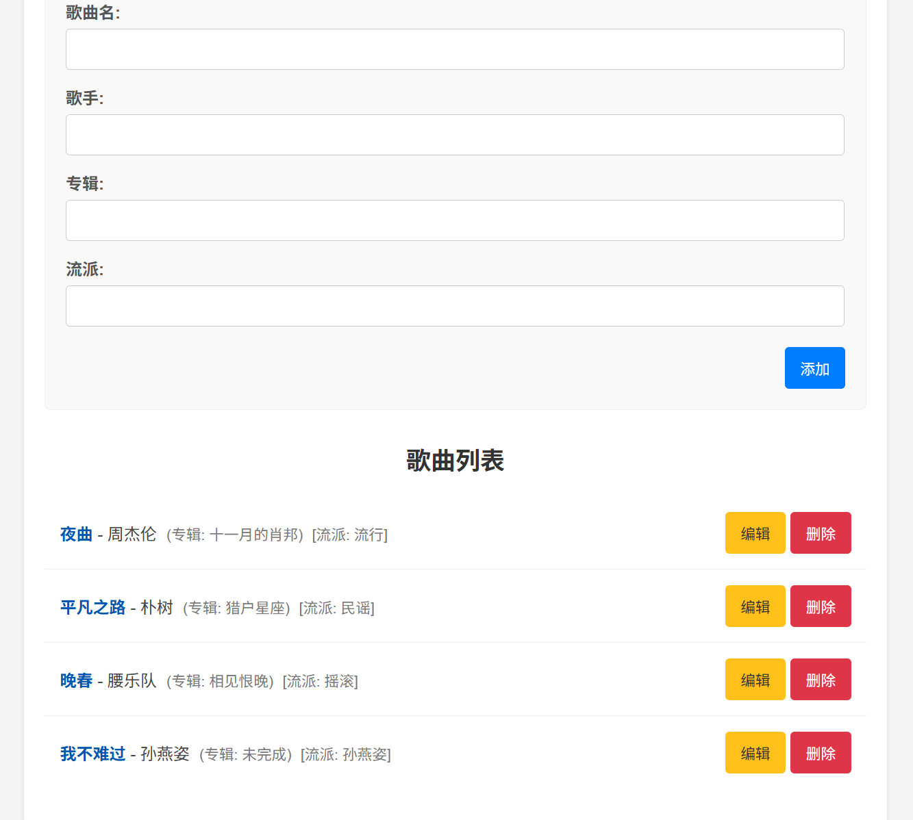
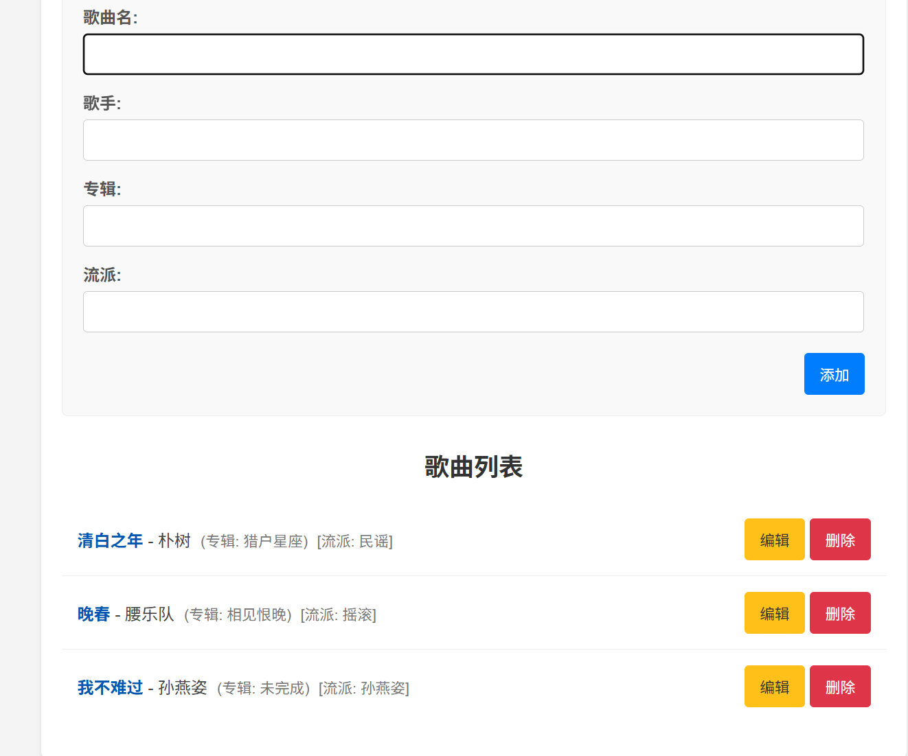

# AI项目——歌曲列表

## 使用说明

后端部署

使用idea打开项目，在application.properties文件下，修改你电脑mysql的信息。

```properties
spring.datasource.url=jdbc:mysql://localhost:3306/yourschema?useSSL=false&serverTimezone=UTC&characterEncoding=utf8
spring.datasource.username=yourname
spring.datasource.password=yourpassword
spring.datasource.driver-class-name=com.mysql.cj.jdbc.Driver
```

在yourschema中创建songs表，即输入如下建表语句

```sql
CREATE TABLE songs (
                       id BIGINT AUTO_INCREMENT PRIMARY KEY COMMENT '歌曲ID，自增主键',
                       title VARCHAR(255) NOT NULL COMMENT '歌曲名称',
                       artist VARCHAR(255) NOT NULL COMMENT '歌手名称',
                       album VARCHAR(255) NULL COMMENT '专辑名称',
                       genre VARCHAR(100) NULL COMMENT '流派'
) ENGINE=InnoDB DEFAULT CHARSET=utf8mb4 COMMENT='歌曲信息表';

-- (可选) 插入一些初始数据用于测试
INSERT INTO songs (title, artist, album, genre) VALUES
('稻香', '周杰伦', '魔杰座', '流行'),
('夜曲', '周杰伦', '十一月的肖邦', '流行'),
('平凡之路', '朴树', '猎户星座', '民谣');
```

运行SongManagerApplication启动类


前端部署

找到nginx目录下的nginx.exe，双击运行。


在浏览器输入localhost:80即可


效果展示







## 开发流程

主要使用Gemini开发


采用前后端分离的框架开发


大致的接口文档为

​      url : “songs”

​      请求类型 ：“GET”

​      响应体格式：

```json
[
    {
        "id": 1,
        "title": "稻香",
        "artist": "周杰伦",
        "album": "魔杰座",
        "genre": "流行"
    },
    {
        "id": 2,
        "title": "夜曲",
        "artist": "周杰伦",
        "album": "十一月的肖邦",
        "genre": "流行"
    },
    {
        "id": 3,
        "title": "平凡之路",
        "artist": "朴树",
        "album": "猎户星座",
        "genre": "民谣"
    }
]
```

​      说明：获取歌曲列表

其他的大同小异


前端只是一个简单的页面


创建vue项目


将ai生成的代码复制到项目中，调试运行成功后，打包部署到nginx上


修改nginx.conf文件，确保前后端接通。

```
location /api/ {
            rewrite ^/api/(.*)$ /$1 break;
            proxy_pass http://localhost:8080; # 替换为你的后端服务地址
            proxy_http_version 1.1;
            proxy_set_header Upgrade $http_upgrade;
            proxy_set_header Connection 'upgrade';
            proxy_set_header Host $host;
            proxy_cache_bypass $http_upgrade;
        }

```

前端部署完成


后端采用SSM框架

首先连接数据库，创表，配置信息

然后写springboot的代码

model类

```java
@Data // Lombok: 自动生成 Getters, Setters, toString, equals, hashCode
@NoArgsConstructor // Lombok: 自动生成无参构造函数
@AllArgsConstructor // Lombok: 自动生成全参构造函数
public class Song {
    private Long id;
    private String title; // 歌曲名
    private String artist; // 歌手
    private String album; // 专辑
    private String genre; // 流派
}
```

controller层

```java
@RestController // 标记为 REST 控制器
@RequestMapping("songs") // 所有请求路径都以 /songs 开头
// @CrossOrigin // 或者在这里配置更细粒度的跨域，但 application.properties 中已全局配置
public class SongController {

    @Autowired // 自动注入 SongService
    private SongService songService;

    // GET /songs - 获取所有歌曲
    @GetMapping
    public ResponseEntity<List<Song>> getAllSongs() {
        List<Song> songs = songService.getAllSongs();
        return ResponseEntity.ok(songs); // 返回 200 OK 和歌曲列表
    }

    // GET /songs/{id} - 根据 ID 获取歌曲
    @GetMapping("/{id}")
    public ResponseEntity<Song> getSongById(@PathVariable Long id) {
        Song song = songService.getSongById(id);
        if (song != null) {
            return ResponseEntity.ok(song); // 返回 200 OK 和歌曲信息
        } else {
            return ResponseEntity.notFound().build(); // 返回 404 Not Found
        }
    }

    // POST /songs - 添加新歌曲
    @PostMapping
    public ResponseEntity<Song> addSong(@RequestBody Song song) {
        // @RequestBody 将请求体中的 JSON 转换为 Song 对象
        try {
            Song createdSong = songService.addSong(song);
            // 返回 201 Created 和新创建的歌曲信息
            return ResponseEntity.status(HttpStatus.CREATED).body(createdSong);
        } catch (Exception e) {
            // 简单的错误处理
            return ResponseEntity.status(HttpStatus.INTERNAL_SERVER_ERROR).build();
        }
    }

    // PUT /songs/{id} - 更新歌曲信息
    @PutMapping("/{id}")
    public ResponseEntity<Song> updateSong(@PathVariable Long id, @RequestBody Song songDetails) {
        try {
            Song updatedSong = songService.updateSong(id, songDetails);
            if (updatedSong != null) {
                return ResponseEntity.ok(updatedSong); // 返回 200 OK 和更新后的歌曲信息
            } else {
                return ResponseEntity.notFound().build(); // 返回 404 Not Found
            }
        } catch (Exception e) {
            // 简单的错误处理
            return ResponseEntity.status(HttpStatus.INTERNAL_SERVER_ERROR).build();
        }
    }

    // DELETE /songs/{id} - 删除歌曲
    @DeleteMapping("/{id}")
    public ResponseEntity<Void> deleteSong(@PathVariable Long id) {
        try {
            boolean deleted = songService.deleteSong(id);
            if (deleted) {
                return ResponseEntity.noContent().build(); // 返回 204 No Content
            } else {
                return ResponseEntity.notFound().build(); // 返回 404 Not Found
            }
        } catch (Exception e) {
            // 简单的错误处理
            return ResponseEntity.status(HttpStatus.INTERNAL_SERVER_ERROR).build();
        }
    }
}
```

接收请求，调用service层处理数据后，响应给前端


service层

```Java
@Service
public class SongService {

    @Autowired // 自动注入 SongMapper
    private SongMapper songMapper;

    // 获取所有歌曲
    public List<Song> getAllSongs() {
        return songMapper.findAll();
    }

    // 根据 ID 获取歌曲
    public Song getSongById(Long id) {
        return songMapper.findById(id);
    }

    // 添加歌曲
    @Transactional // 添加事务管理
    public Song addSong(Song song) {
        songMapper.insert(song);
        // 因为 insert 方法设置了 useGeneratedKeys=true 和 keyProperty="id"
        // 所以插入后 song 对象会包含数据库生成的 ID
        return song;
    }

    // 更新歌曲
    @Transactional // 添加事务管理
    public Song updateSong(Long id, Song songDetails) {
        Song existingSong = songMapper.findById(id);
        if (existingSong != null) {
            // 更新字段
            existingSong.setTitle(songDetails.getTitle());
            existingSong.setArtist(songDetails.getArtist());
            existingSong.setAlbum(songDetails.getAlbum());
            existingSong.setGenre(songDetails.getGenre());
            songMapper.update(existingSong);
            return existingSong;
        }
        return null; // 或者抛出异常，表示歌曲未找到
    }

    // 删除歌曲
    @Transactional // 添加事务管理
    public boolean deleteSong(Long id) {
        int rowsAffected = songMapper.deleteById(id);
        return rowsAffected > 0; // 如果影响行数大于0，则删除成功
    }
}
```

调用mapper层，获得数据，处理后返回给controller层


mapper层

```java
@Mapper // 标记为 MyBatis Mapper 接口
public interface SongMapper {

    // 查询所有歌曲
    @Select("SELECT id, title, artist, album, genre FROM songs")
    List<Song> findAll();

    // 根据 ID 查询歌曲
    @Select("SELECT id, title, artist, album, genre FROM songs WHERE id = #{id}")
    Song findById(Long id);

    // 插入歌曲 (返回影响的行数)
    // useGeneratedKeys=true 和 keyProperty="id" 让 MyBatis 将数据库生成的自增 ID 赋值给 song 对象的 id 属性
    @Insert("INSERT INTO songs(title, artist, album, genre) VALUES(#{title}, #{artist}, #{album}, #{genre})")
    @Options(useGeneratedKeys = true, keyProperty = "id")
    int insert(Song song);

    // 更新歌曲 (返回影响的行数)
    @Update("UPDATE songs SET title=#{title}, artist=#{artist}, album=#{album}, genre=#{genre} WHERE id=#{id}")
    int update(Song song);

    // 根据 ID 删除歌曲 (返回影响的行数)
    @Delete("DELETE FROM songs WHERE id = #{id}")
    int deleteById(Long id);
}
```

与数据库交互，返回数据给service层

启动项目


